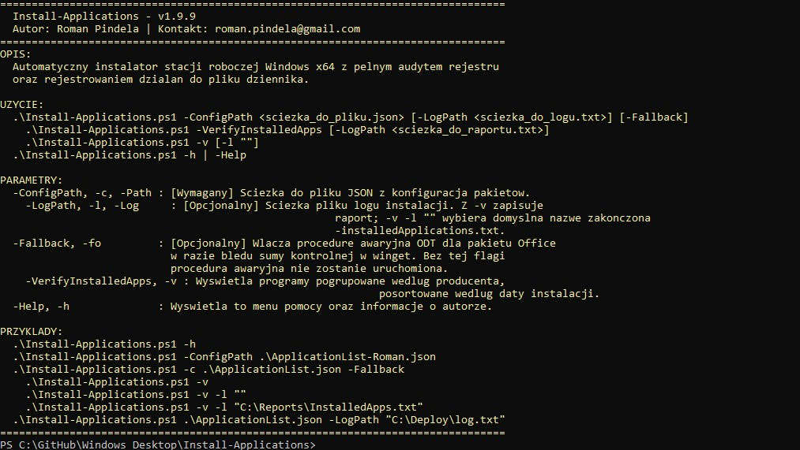
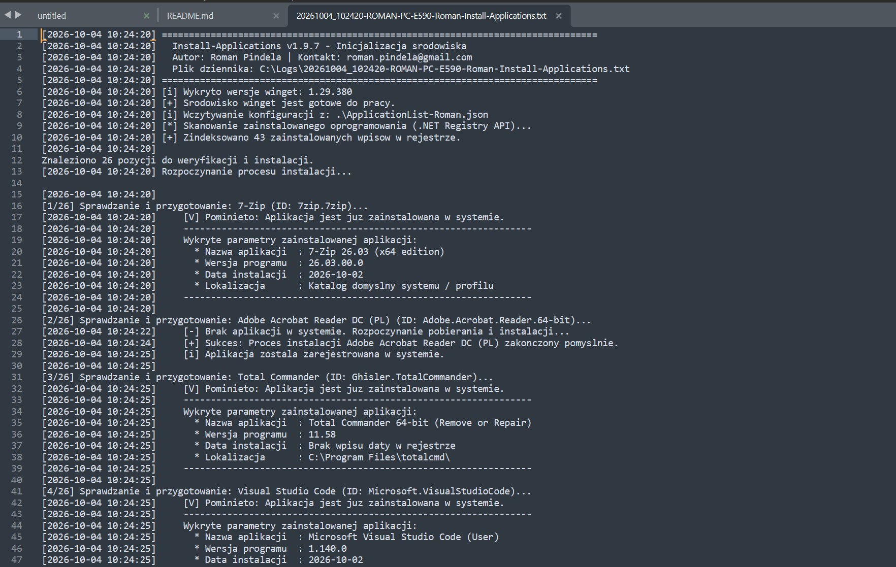
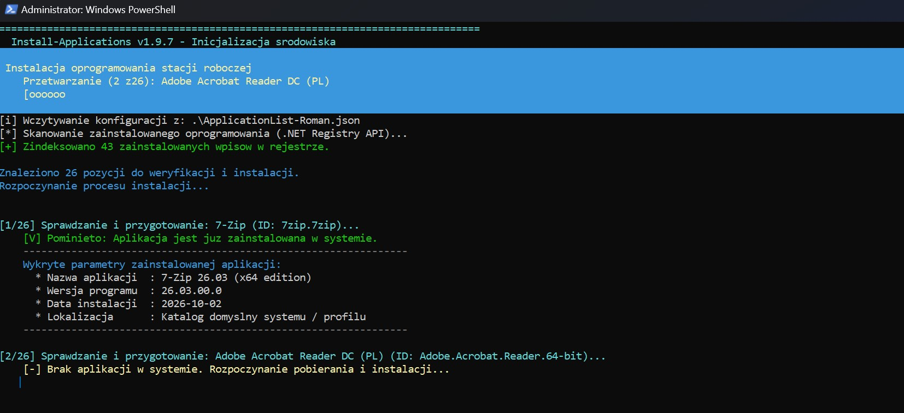
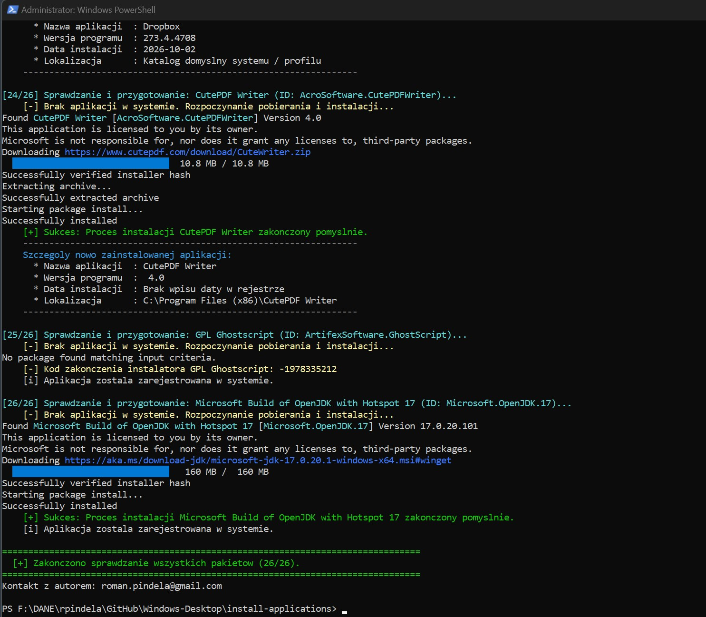

# install-applications (Windows Workstation Deployment)
Technical documentation for the automation script facilitating system auditing, downloading, installing, and unattended deployment of software on Windows workstations.

## Project Information

| Parameter | Value |
| :--- | :--- |
| **Project Name** | install-applications (Windows Workstation Deployment) |
| **Author** | Roman Pindela |
| **Contact** | roman.pindela@gmail.com |
| **Version** | 1.9.9 |
| **Release Date** | 2026-10-04 |
| **License** | MIT |
| **Repository** | [GitHub - roman/install-applications](https://github.com/roman/install-applications) |

---

## Key Features

* **No Hardcoded Packages:** The application list is parsed exclusively from a user-specified JSON configuration file.
* **Structured Text Logging:** Every execution generates a comprehensive log file with precise timestamps `[YYYY-MM-DD HH:MM:SS]`.
  * Default path: `C:\Logs\<DateTime>-<Computer>-<User>-Install-Applications.txt`.
  * Automatically creates missing destination directories.
  * Custom paths supported via `-LogPath`.
* **In-Memory Registry Audit via .NET Registry API:** Fast, single-pass in-memory software inventory via native `[Microsoft.Win32.RegistryKey]`. Scans the following hives:
  * `HKLM` 64-bit (`SOFTWARE\Microsoft\Windows\CurrentVersion\Uninstall`)
  * `HKLM` 32-bit / WOW6432Node (`SOFTWARE\WOW6432Node\Microsoft\Windows\CurrentVersion\Uninstall`)
  * `HKCU` logged-on user profile (`SOFTWARE\Microsoft\Windows\CurrentVersion\Uninstall`)
* **Smart Matching:** Strips parenthetical noise and correlates base product names reliably with Windows registry uninstall entries.
* **Precise Application Metadata:** Captures product name (`DisplayName`), version (`DisplayVersion`), installation date (`InstallDate`), and location (`InstallLocation` / `DisplayIcon`).
* **Installed Applications Report:** The `-VerifyInstalledApps` switch (alias `-v`) generates a clear report grouped by software publisher and sorted by install date, including architecture, installation scope, and disk footprint. Long names wrap cleanly.
* **Full Idempotence (Skip Already Installed):** Detected applications are immediately skipped while displaying their existing installation metadata.
* **Automatic User-Context Installation (Non-Admin Fallback):** Packages rejecting elevated administrator contexts (error code `0x8A150056` / `-1978335146`, e.g., Spotify) are automatically dispatched to run under the interactive user profile (`--scope user`) via a temporary `ScheduledTask`.
* **Optional Office 365 Fallback (ODT):** Executed **strictly when `-Fallback` is specified** in situations where winget encounters a hash checksum mismatch (`-1978335215`). Disabled by default to avoid unintended downloads.
* **Automated WinGet Self-Repair:** Validates the minimum required package manager version (>= 1.7.0) and repairs the installation via `Microsoft.WinGet.Client` when needed.
* **Visual Progress Tracking:** Real-time console progress bar using `Write-Progress` with `[X/Y]` task indices.

---

## Deployment Directory Structure

```shell
install-applications/
├── Install-Applications.ps1       # Main PowerShell installation script
├── ApplicationList-Roman.json     # Custom workstation package list
├── ApplicationList.json           # Default template package list
└── README.md                      # Technical documentation
```

---

## System Requirements
* **Operating System:** Windows 10 / Windows 11 (64-bit architecture).
* **Privileges:** PowerShell running with Administrator privileges (required for machine-wide installs and fallback task registration). The audit report (`-VerifyInstalledApps`) can run without elevation.
* **Network Connectivity:** Internet access to official vendor CDNs and the WinGet package repository.

---

## Usage Guide

### 1. Allow Script Execution (If Restricted)
```shell
Set-ExecutionPolicy -ExecutionPolicy RemoteSigned -Scope CurrentUser
```

### 2. Display Help Menu & Author Information
```shell
.\Install-Applications.ps1 -h
```

### 3. Run Package Installation
```shell
.\Install-Applications.ps1 -ConfigPath .\ApplicationList-Roman.json
```
*(Positional syntax is also supported: `.\Install-Applications.ps1 .\ApplicationList-Roman.json`)*

### 4. Generate Installed Applications Audit Report
```shell
.\Install-Applications.ps1 -VerifyInstalledApps
# Short form:
.\Install-Applications.ps1 -v
# Save to default file in C:\Logs (suffix -installedApplications.txt):
.\Install-Applications.ps1 -v -l ""
# Save to a custom path:
.\Install-Applications.ps1 -v -l "C:\Reports\InstalledApps.txt"
```

---

## JSON Configuration Format & Example
The JSON file contains an array of objects, each defining a human-readable `Name` and its corresponding `Id` in the winget repository:

```json
[
  { "Name": "7-Zip", "Id": "7zip.7zip" },
  { "Name": "Adobe Acrobat Reader DC (PL)", "Id": "Adobe.Acrobat.Reader.64-bit" },
  { "Name": "Sublime Text 4", "Id": "SublimeHQ.SublimeText.4" },
  { "Name": "Total Commander", "Id": "Ghisler.TotalCommander" },
  { "Name": "Visual Studio Code", "Id": "Microsoft.VisualStudioCode" },
  { "Name": "Google Drive", "Id": "Google.GoogleDrive" },
  { "Name": "Microsoft OneDrive", "Id": "Microsoft.OneDrive" },
  { "Name": "Microsoft 365 Apps (Office)", "Id": "Microsoft.Office" },
  { "Name": "Google Chrome", "Id": "Google.Chrome" },
  { "Name": "IrfanView", "Id": "IrfanSkiljan.IrfanView" },
  { "Name": "VLC Media Player", "Id": "VideoLAN.VLC" },
  { "Name": "Spotify", "Id": "Spotify.Spotify" },
  { "Name": "Microsoft Teams", "Id": "Microsoft.Teams" },
  { "Name": "Mozilla Firefox", "Id": "Mozilla.Firefox" },
  { "Name": "Opera Stable", "Id": "Opera.Opera" },
  { "Name": "Brave Browser", "Id": "Brave.Brave" },
  { "Name": "Microsoft PowerToys", "Id": "Microsoft.PowerToys" },
  { "Name": "TeamViewer", "Id": "TeamViewer.TeamViewer" },
  { "Name": "Git for Windows", "Id": "Git.Git" },
  { "Name": "Notepad++", "Id": "Notepad++.Notepad++" },
  { "Name": "Windows Terminal", "Id": "Microsoft.WindowsTerminal" }
]
```

---

## Sample Console Output During Run

```shell
================================================================================
  Install-Applications v1.9.9 - Environment Initialization
  Author: Roman Pindela | Contact: roman.pindela@gmail.com
================================================================================
[i] Detected winget version: 1.29.380
[+] winget environment is ready.
[i] Loading configuration from: .\ApplicationList-Roman.json
[*] Scanning installed software (.NET Registry API)...
[+] Indexed 41 installed entries in registry.

Found 26 items to verify and install.
Starting installation process...

[1/26] Verifying and preparing: 7-Zip (ID: 7zip.7zip)...
    [V] Skipped: Application is already installed on system.
    ----------------------------------------------------------------
    Detected parameters of installed application:
      * Application Name : 7-Zip 24.08 (x64)
      * Program Version  : 24.08.00.0
      * Install Date     : 2026-10-02
      * Location         : C:\Program Files\7-Zip
    ----------------------------------------------------------------

[2/26] Verifying and preparing: Spotify (ID: Spotify.Spotify)...
    [-] Application not found on system. Starting download and installation...
    [!] Package Spotify requires installation in user profile.
        -> Starting task in logged-on user context...
    [+] Successfully completed installation in user profile.
    ----------------------------------------------------------------
    Details of newly installed application:
      * Application Name : Spotify
      * Program Version  : 1.2.50.335
      * Install Date     : 2026-10-04
      * Location         : C:\Users\rpindela\AppData\Roaming\Spotify
    ----------------------------------------------------------------
```

---

## Exit Codes & Diagnostics

| Status / Exit Code | Technical Meaning | Script Action |
| --- | --- | --- |
| **0** | Installer success | Retrieves and logs metadata of newly installed package. |
| **-1978335189 (0x8A15002B)** | Package is already registered in system | Pulls entry from registry inventory, displays metadata, and skips install. |
| **-1978335146 (0x8A150056)** | Elevated admin context blocked by installer | Automatically dispatches user profile install via scheduled task (`--scope user`). |
| **-1978335215 (0x8A150011)** | Hash checksum mismatch (*Hash Mismatch*) | Executes emergency fallback routine (if `-Fallback` was specified). |
| **-1073741819 (0xC0000005)** | Legacy winget critical crash | Automated repair and update via `Microsoft.WinGet.Client`. |

---

## Screenshots - Execution View

### Standard Run


### Log File


### Installing Apps


### Installing Apps 2


---

## Contact & Support
For deployment questions or technical support:
* **Author:** Roman Pindela
* **Email:** roman.pindela@gmail.com
* **License:** MIT License
