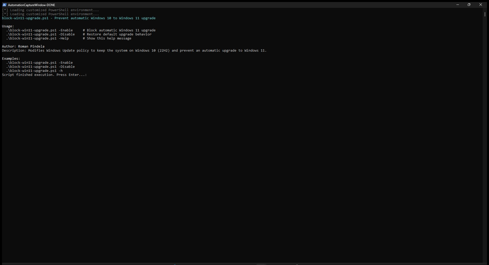

# Manage Windows 11 Upgrade

## Overview
`block-win11-upgrade.ps1` is a PowerShell script designed to control the automatic upgrade path from Windows 10 to Windows 11. By default, the script pins the system to Windows 10 (22H2) by modifying the appropriate local registry policies. 

## Usage

**To block the Windows 11 upgrade (Default behavior):**
```powershell
.\block-win11-upgrade.ps1
```

**To allow/unblock the Windows 11 upgrade:**
```powershell
.\block-win11-upgrade.ps1 -Disable
```

Alternatively, to view standard help:
```powershell
Get-Help .\block-win11-upgrade.ps1 -Full
```

## Error Handling
The script encapsulates the execution logic inside a strict `try-catch` block. It explicitly handles:
* **Registry Access:** Catches exceptions related to unauthorized access or missing paths during modification.
* **Graceful Key Removal:** Employs `-ErrorAction SilentlyContinue` when attempting to remove keys, preventing terminal errors if the keys do not exist in the first place.

## Clean Code Standards Applied
* **No Hardcoded Values:** Registry paths are parameterized as variables to ensure the script remains easy to update and modify.
* **Silent Pipeline Pollution Prevention:** Pipes output to `Out-Null` during successful item creation to maintain clean standard output.
* **Native Cmdlet Binding:** Utilizes `[CmdletBinding()]` to support native PowerShell features like `-Verbose` and standard parameter handling.

## Author & Version Information
* **Author:** Roman Pindela
* **Email:** roman.pindela@gmail.com
* **GitHub:** github.com/romanpindela
* **Script Version:** 1.0.0
* **Release Date:** July 2026
* **License:** MIT License. Feel free to use, modify, and distribute in enterprise environments.

## Execution View


### Help Output (-Help)

