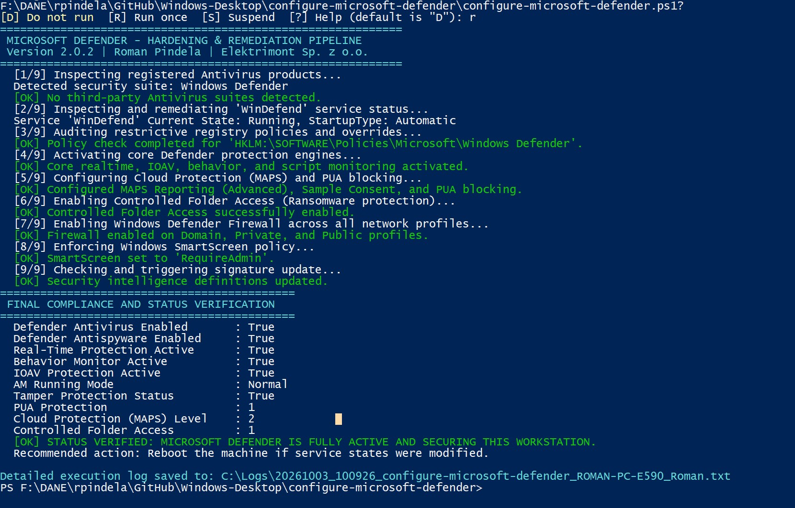
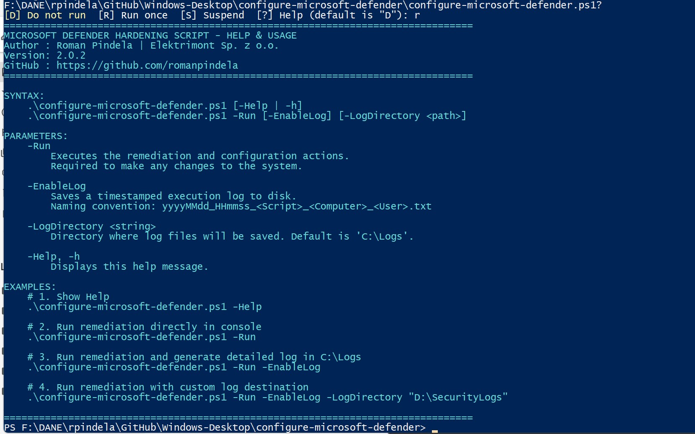

# configure-microsoft-defender.ps1

Enterprise hardening, repair, and configuration automation script for **Microsoft Defender Antivirus** and **Windows Security** on Windows 10/11 and Windows Server.

---

## Author & Project Metadata

- **Author**: Roman Pindela
- **GitHub**: [github.com/romanpindela](https://github.com/romanpindela)
- **Email**: roman.pindela@gmail.com
- **Version**: 2.0.0
- **License**: MIT

---

## Key Features

1. **Non-destructive & Clean Code Design**:
   - Modular functions with isolated `try/catch` handlers.
   - Elimination of silent error suppression (`$ErrorActionPreference = 'SilentlyContinue'`).
   - CLI parameter safety guard: invoking without `-Run` outputs help instead of making unintended changes.
2. **Comprehensive Hardening Pipeline**:
   - **Service Health**: Restores `WinDefend` service startup type to `Automatic` and ensures execution.
   - **Policy Cleanup**: Removes legacy GPO / registry disables (`DisableAntiSpyware`, `DisableAntiVirus`, `DisableRealtimeMonitoring`).
   - **Realtime Engines**: Enforces Behavior Monitoring, IOAV Scanning, Script Scanning, Archive Scanning, and Block-at-First-Seen.
   - **Cloud Security**: Activates Microsoft Advanced Protection Service (MAPS) and PUA (Potentially Unwanted Application) blocking.
   - **Ransomware Defense**: Enables Controlled Folder Access.
   - **Perimeter Defense**: Enforces Windows Defender Firewall across all three network profiles (`Domain`, `Private`, `Public`).
   - **SmartScreen**: Sets SmartScreen policy to require administrative elevation.
   - **Intelligence Feeds**: Forces a definition/signature refresh via `Update-MpSignature`.
3. **Structured Logging**:
   - Built-in parameter `-EnableLog`.
   - Dynamic filename format: `yyyyMMdd_HHmmss_<ScriptName>_<ComputerName>_<UserName>.txt`.
   - Default log path: `C:\Logs\` (configurable via `-LogDirectory`).

---

## Requirements

- **Operating System**: Windows 10, Windows 11, Windows Server 2019/2022/2026.
- **PowerShell**: PowerShell 5.1 or PowerShell 7+.
- **Privileges**: Elevated Administrator privileges (`Run as Administrator`).

---

## Syntax & Usage

### 1. View Help (Default Behavior)
Running the script without parameters or with `-Help` / `-h` displays standard Comment-Based Help:
```powershell
.\configure-microsoft-defender.ps1
# or
.\configure-microsoft-defender.ps1 -Help
# or
.\configure-microsoft-defender.ps1 -h
```

## Screenshots & Examples

### PowerShell Console Output


### PowerShell Console Output
