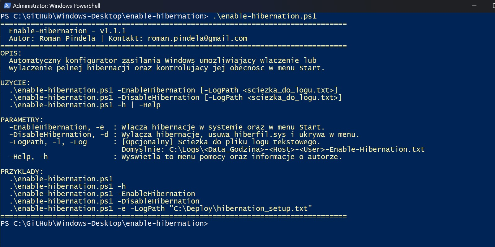
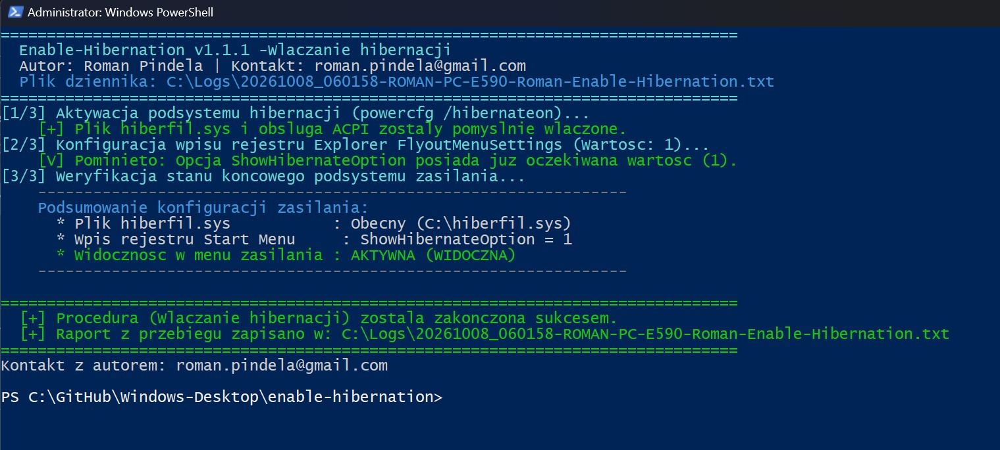
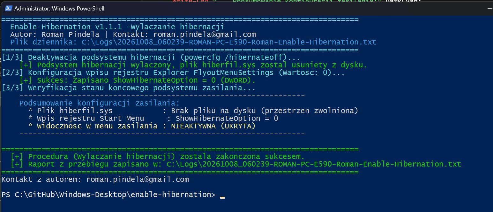

# enable-hibernation (Windows Power Management Configuration)
  
Technical documentation for the automation script managing the hibernation subsystem and the visibility of the Hibernate option in the Windows Start menu power options.
  
## Project Information
  
| Parameter | Value |
| :--- | :--- |
| **Project Name** | enable-hibernation (Windows Power Management Configuration) |
| **Author** | Roman Pindela |
| **Contact** | roman.pindela@gmail.com |
| **Version** | 1.1.1 |
| **Release Date** | 2026-10-08 |
| **License** | MIT |
| **Repository** | [GitHub - roman/enable-hibernation](https://github.com/roman/enable-hibernation) |
  
---
  
## Key Features
  
* **Interactive Help on Launch:** Running the script without parameters or with `-h` / `-Help` immediately displays version information, author metadata, syntax, and usage examples.
* **Bidirectional State Management:**
  * `-EnableHibernation`: Allocates `hiberfil.sys`, activates the ACPI mechanism, and adds Hibernate to the Start menu power options.
  * `-DisableHibernation`: Removes `hiberfil.sys` (freeing gigabytes of system disk space) and hides Hibernate from the Start menu.
* **Full Idempotence:** The script verifies the existing value of `ShowHibernateOption` in the registry; if the desired state is already set, modifications are safely skipped.
* **Advanced Text Logging:** Every execution creates a detailed log file with precise timestamps `[YYYY-MM-DD HH:MM:SS]`.
  * Default path: `C:\Logs\<DateTime>-<Computer>-<User>-Enable-Hibernation.txt`.
  * Automatically creates missing target directories.
  * Allows custom path specification via the `-LogPath` parameter.
* **Direct Registry Audit & Modification via .NET Registry API:** Native operations via `[Microsoft.Win32.RegistryKey]` on the 64-bit `HKLM` view under `SOFTWARE\Microsoft\Windows\CurrentVersion\Explorer\FlyoutMenuSettings`.
* **Post-Execution State Verification:** Automated audit verifying the presence of `hiberfil.sys` on the system drive and the exact DWORD registry state.
  
---
  
## Directory Structure
  
```shell
enable-hibernation/
├── assets/
│   ├── Standard_run.jpg          # Standard run / help menu view
│   ├── enable_hibernation.jpg     # Screenshot of enabling hibernation
│   └── disable_hibernation.jpg    # Screenshot of disabling hibernation
├── enable-hibernation.ps1        # Main PowerShell configuration script
└── README.md                     # Technical documentation
```
  
## System Requirements
  
- **Operating System:** Windows 10 / Windows 11 (64-bit architecture).
- **Privileges:** PowerShell console running with Administrator privileges (required for `hiberfil.sys` management and HKLM modifications).
  
## Usage Guide
  
### 1. Allow Script Execution (If Restricted)
```shell
Set-ExecutionPolicy -ExecutionPolicy RemoteSigned -Scope CurrentUser
```
  
### 2. Display Help Menu & Author Information
```shell
.\enable-hibernation.ps1
# (or: .\enable-hibernation.ps1 -h)
```
  
### 3. Enable Hibernation and Add to Start Menu
```shell
.\enable-hibernation.ps1 -EnableHibernation
# (or: .\enable-hibernation.ps1 -e)
```
  
### 4. Disable Hibernation and Free Disk Space
```shell
.\enable-hibernation.ps1 -DisableHibernation
# (or: .\enable-hibernation.ps1 -d)
```
  
### 5. Run with Custom Log File Path
```shell
.\enable-hibernation.ps1 -EnableHibernation -LogPath "C:\Deploy\hibernation.txt"
```
  
## Screenshots
  
### Standard Run / Help

  
### Enabling Hibernation (-EnableHibernation)

  
### Disabling Hibernation (-DisableHibernation)

  
## Exit Codes & Diagnostics
  
| Status / Exit Code | Technical Meaning | Script Action |
| :--- | :--- | :--- |
| **0** | Successful execution | Desired operation (enable/disable) completed successfully. |
| **Missing admin rights** | Executed without elevated UAC privileges | Throws exception and immediately stops execution (`throw`). |
| **powercfg error** | Exit code of `powercfg.exe` other than 0 | Logs warning to console and log file. |
  
## Contact & Support
  
For questions or issues regarding deployment:
- **Author:** Roman Pindela
- **Email:** roman.pindela@gmail.com
- **License:** MIT License