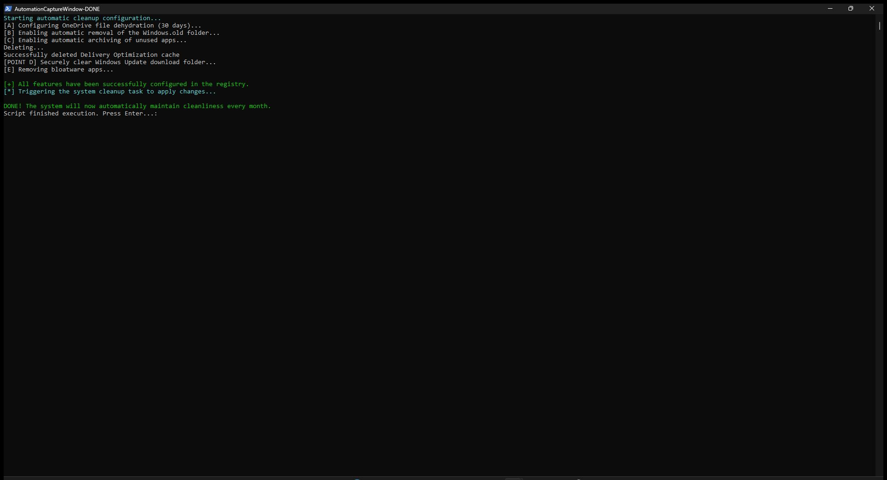
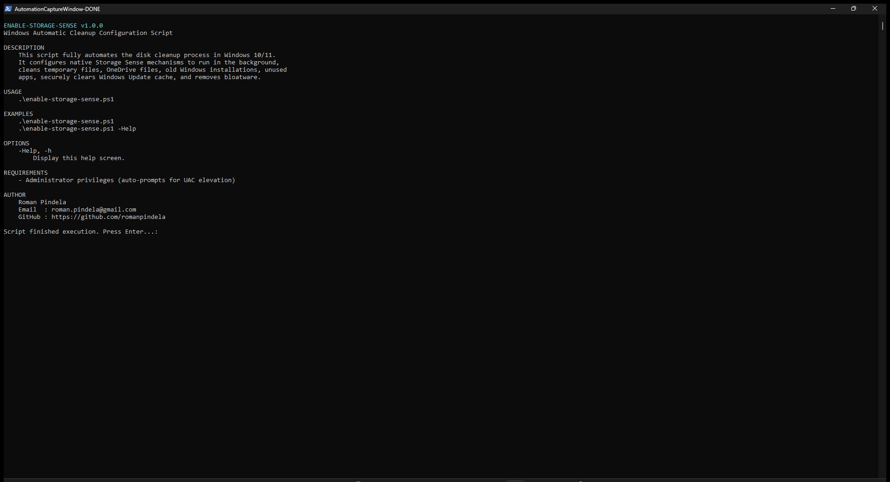

# Windows Automatic Cleanup Script (Storage Sense Combo)

A PowerShell script designed to fully automate the disk cleanup process in **Windows 10** and **Windows 11** systems. Instead of installing third-party software (e.g., CCleaner), the script configures advanced, safe native mechanisms built directly into the operating system.

## 🚀 What does this script do?

The script activates the **Storage Sense** feature and configures it for maximum (yet safe) performance:

*   **Schedule:** Sets the automatic system cleanup to run **once a week** in the background.
*   **Temporary files:** Automatically deletes unnecessary logs and application temporary files.
*   **Recycle Bin:** Cleans up files from the system Recycle Bin that have been there for more than 14 days.

### ⚙️ Advanced features enabled by the script:

*   **[Point A] OneDrive Optimization (Files On-Demand):**
    OneDrive cloud files that you haven't opened for at least **30 days** are automatically freed from the local drive (they become "online-only" files). You don't lose access to them, and upon clicking them again, the system will download them automatically.
*   **[Point B] Windows.old folder cleanup:**
    Initiates a safe cleanup mechanism after major Windows feature updates. It cleans up gigabytes of no longer needed files from old system installations.
*   **[Point C] Archiving rarely used applications:**
    Freezes rarely used apps originating from the Microsoft Store. The application installation files are removed, recovering valuable space, while all your private configurations, saves, and settings remain untouched on the drive.

---

## 🛠️ How to run it?

The script modifies system settings, so it **must** be run with Administrator privileges.

### Step 1: Unblocking script execution (One-time)
By default, Windows blocks the execution of scripts from files. To allow its execution:
1. Open the Start menu, type **PowerShell**.
2. Right-click on it and select **"Run as Administrator"**.
3. Enter the following command and press `Enter`:
```powershell
   Set-ExecutionPolicy RemoteSigned -Scope CurrentUser -Force

## Execution View

### Standard Run


### Help Output (-Help)

