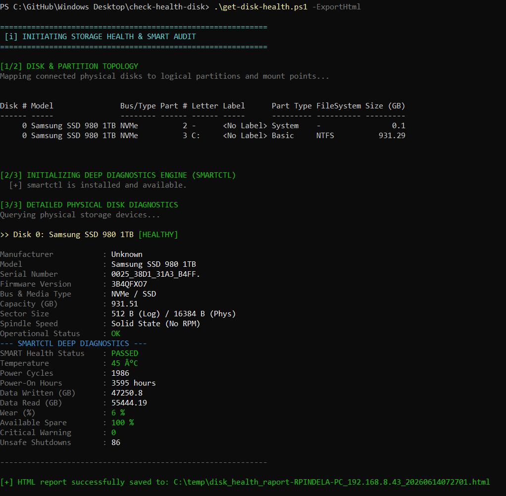
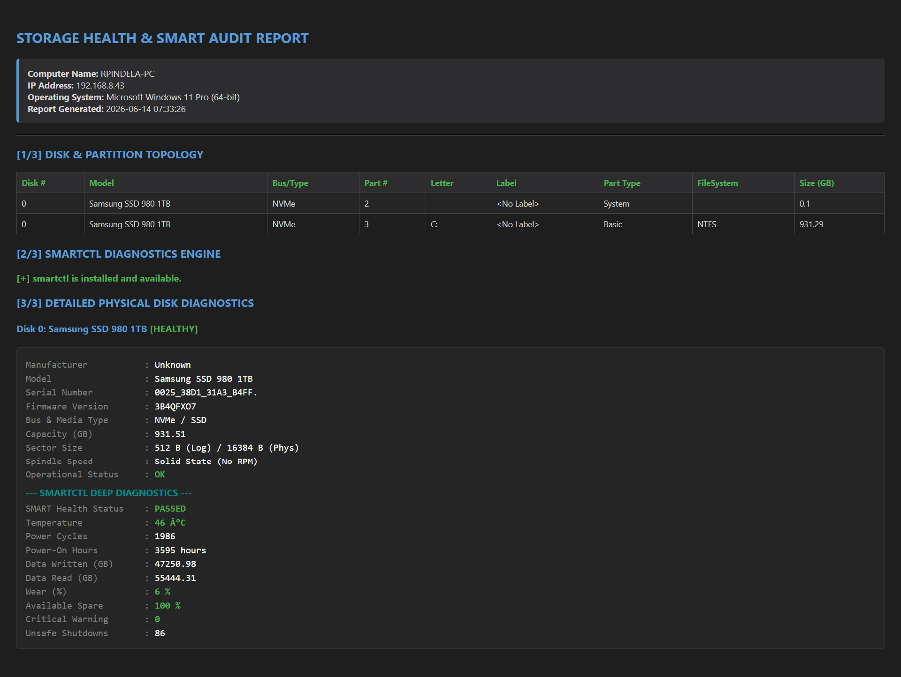

# Storage Health & SMART Diagnostic Script

A professional PowerShell utility designed to query detailed information about locally connected physical disks, map their topology, and retrieve native SMART (Storage Reliability Counters) health data.

## 🚀 Features

* **Topology Mapping:** Generates a clear table mapping physical disks to logical partitions, including their drive letters, file systems, and mount labels.
* **Auto-Provisioning of Smartmontools:** The script checks for `smartctl`. If absent, it automatically downloads and installs it via `winget` in the background to ensure the highest possible analysis depth.
* **Deep SMART Diagnostics:** Utilizes JSON-parsed `smartctl` output (or falls back to native Windows WMI counters) to report accurate metrics for SSDs/HDDs, specifically NVMe drives, including:
  * Manufacturer, Model, Firmware Version, and Serial Number
  * Bus Type (NVMe, SATA, USB) and Media Type (SSD, HDD)
  * **Total Data Written / Read (GB)**
  * **Power-On Hours & Power Cycles**
  * **Wear Level (%) & Available Spare** – Color-coded lifespan estimation
  * **Temperature** – Color-coded thresholds to warn about overheating
  * **Unsafe Shutdowns & Critical Warnings**
* **Smart Threshold Colorizer:** The console output dynamically highlights critical health statuses, extreme temperatures (> 70°C), and high wear levels (> 90%) in **Red** or **Yellow** to easily spot failing hardware.
* **HTML Report Export:** Ability to seamlessly export all gathered data, including the highlighted alert colors and tables, into a responsive HTML file for archival or email sharing.
* **Safe Execution:** Automatically prompts for UAC Administrator elevation if launched from a standard console.

## 🛠️ Prerequisites

* **OS:** Windows 10 / Windows 11 / Windows Server 2016+
* **Privileges:** Administrator privileges are required to query low-level Storage Reliability Counters.

## 📦 Usage

### Basic Execution

Simply run the script in PowerShell. If you are not running as Administrator, a standard Windows UAC prompt will securely ask you for permission.

```powershell
.\get-disk-health.ps1
```

To display the help screen:

```powershell
.\get-disk-health.ps1 -Help
```

---

## Screenshots & Examples

### PowerShell Console Output


### Generated HTML Report


*Note: Native Windows Management Instrumentation (WMI/CIM) does not expose the "Manufacturing Date" of physical drives. For this specific metric, proprietary vendor software (e.g., Samsung Magician) is typically required.*