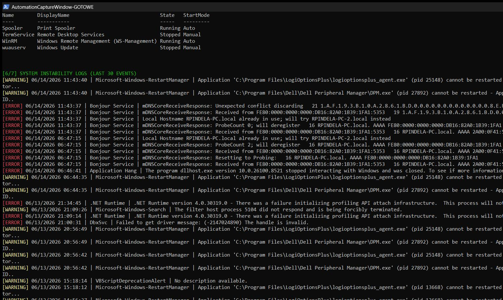
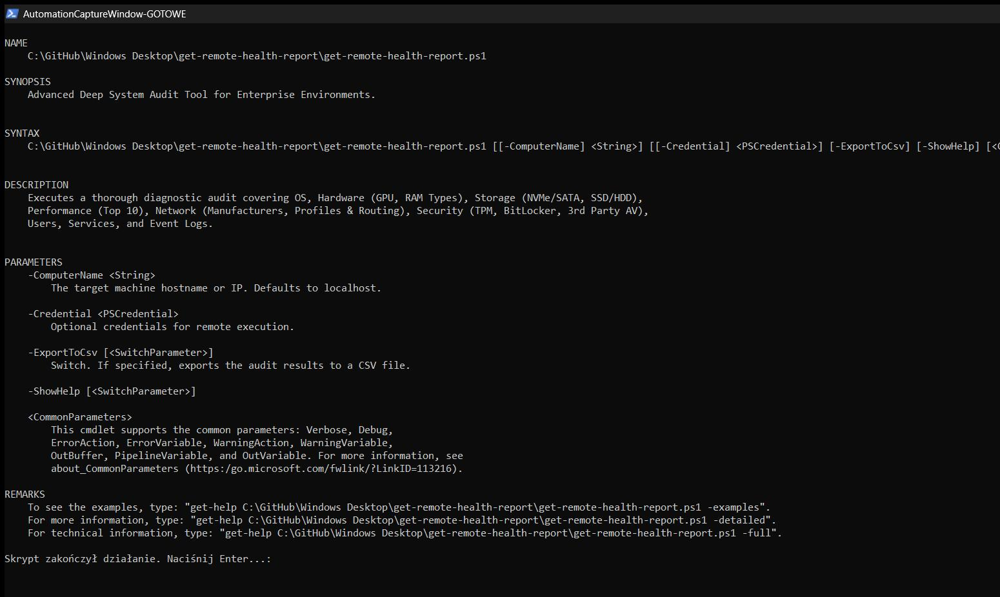

# Deep System Audit Tool v6.0 (`get-remote-health-report.ps1`)

A highly advanced, visually optimized PowerShell diagnostic utility for Windows 10/11 and Windows Server infrastructure. Designed to provide IT Architects and Administrators with immediate, deep visibility into system stability, network hardware, and security compliance.

## Overview
Version 6.0 resolves WMI parameter splatting conflicts, ensuring bulletproof execution even in restricted environments. It introduces deep hardware interrogation, revealing GPU manufacturers, RAM specifications (DDR generation & speed), Disk interfaces (NVMe/SATA), and Network Adapter manufacturers.

**Note:** For deep hardware visibility (Physical Disks, Network Profiles, BitLocker, Antivirus), this script **MUST be run as Administrator**.

## Advanced Diagnostic Capabilities

### 1. OS & Hardware Deep Dive
* **What it checks:** CPU model, **GPU details & VRAM**, and precise **RAM generation (DDR3/DDR4/DDR5)** alongside its frequency (MHz).
* **Audit Focus:** Crucial for verifying hardware baselines and ensuring workstations meet software operational requirements without needing third-party tools like CPU-Z.

### 2. Storage & Media Auditing
* **What it checks:** Audits logical volumes for capacity and queries `MSFT_PhysicalDisk` for exact **Disk Type (SSD/HDD)** and **Bus Interface (NVMe/SATA)**.
* **Audit Focus:** Detects legacy mechanical drives or slow SATA interfaces that may cause severe IOPS bottlenecks in modern workflows.

### 3. Comprehensive Network & Routing Analysis
* **What it checks:** 
  * Retrieves Network Adapters with their IP, Gateway, **Manufacturer, and exact Model**.
  * Checks Network Profiles (Public, Private, Domain).
  * Dumps the IPv4 Routing Table.

### 4. Enterprise Security & Antivirus
* **What it checks:** 
  * Queries `SecurityCenter2` for **Third-Party Antivirus** (e.g., ESET, Bitdefender).
  * Validates native Windows Defender engine and signature status.
  * Verifies BitLocker volume encryption status.

### 5. Instability Log Tracking
* **What it checks:** Scrapes both the `System` and `Application` event logs for the **30 most recent Errors AND Warnings** over the last 24 hours. Formatted line-by-line with severity color-coding.

## Usage Examples

### 1. Local Interactive Audit (Run as Administrator)
```powershell
.\get-remote-health-report.ps1


2. Remote Enterprise Audit
PowerShell
.\get-remote-health-report.ps1 -ComputerName "SRV-FILE-01"
Prerequisites
Elevation: Local execution requires "Run as Administrator" for deep WMI interrogation (Root\Microsoft\Windows\Storage, SecurityCenter2).

WinRM Enablement: Remote target machines must have PowerShell Remoting enabled (Enable-PSRemoting).

Author: Roman Pindela | GitHub: romanpindela | Version: 6.0.0
```
## Execution View

### Standard Run


### Help Output (-Help)

