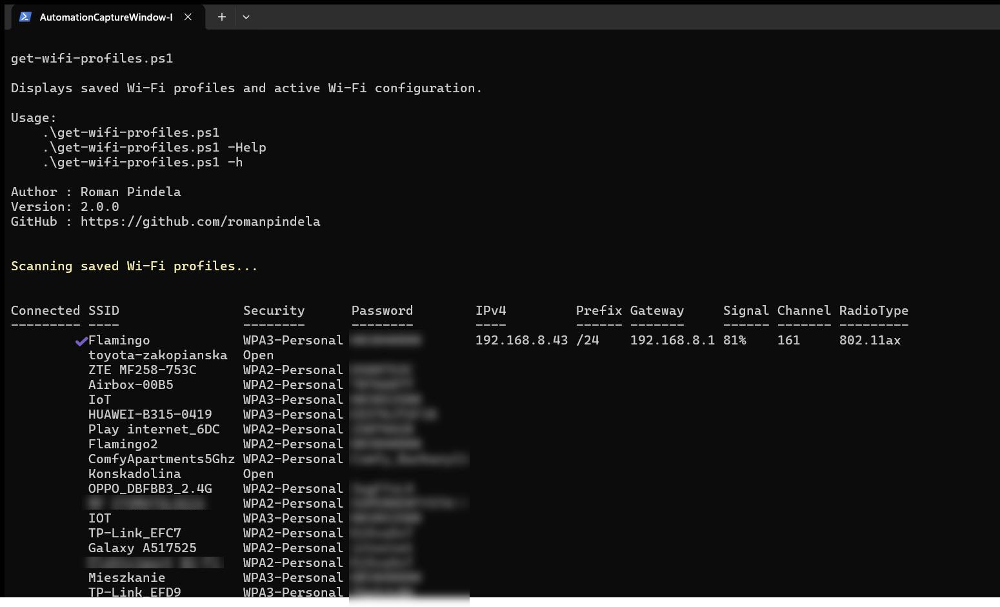
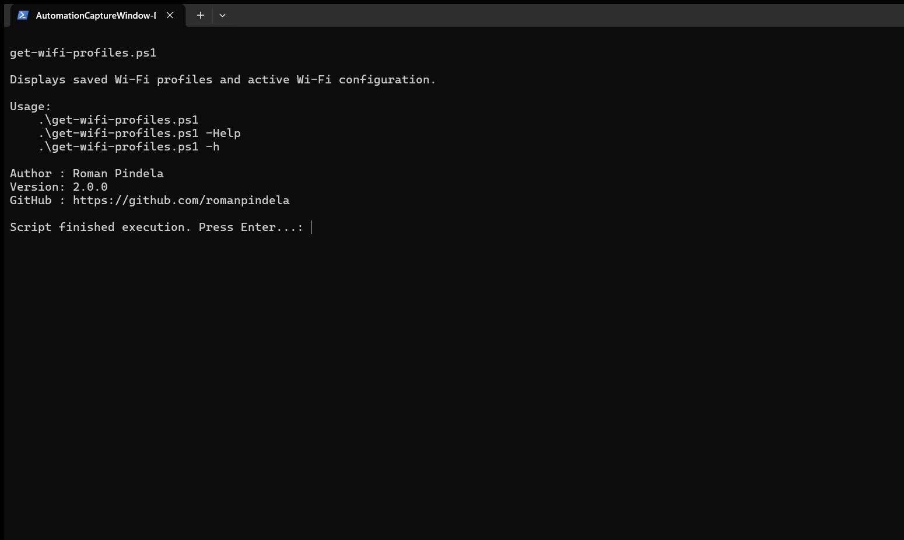

# get-wifi-profiles

Professional PowerShell script for auditing saved Wi-Fi profiles and displaying active wireless network configuration.

## Features

### Saved Wi-Fi Profiles

- Lists all saved Wi-Fi profiles
- Displays stored Wi-Fi passwords
- Displays authentication/security type
- Identifies currently connected Wi-Fi network

### Active Wi-Fi Information

For the currently connected Wi-Fi network:

- IPv4 Address
- Prefix Length
- Default Gateway
- DNS Servers
- Signal Strength
- Radio Type
- Channel Number

### Other Features

- Built-in help system
- PowerShell CmdletBinding support
- Clean Code implementation
- No environment-specific hardcoded values
- Safe handling of empty or unavailable data

---

## Requirements

### Supported Operating Systems

- Windows 10
- Windows 11
- Windows Server 2019+
- Windows Server 2022+

### PowerShell

- PowerShell 5.1 or newer

### Permissions

Recommended:

```powershell
Run as Administrator
```

Administrator privileges may be required to display stored Wi-Fi passwords.

---

## Usage

Display help:

```powershell
.\get-wifi-profiles.ps1 -Help
```

or

```powershell
.\get-wifi-profiles.ps1 -h
```

Run scan:

```powershell
.\get-wifi-profiles.ps1
```

---

## Example Output

| Connected | SSID | Security | Password | IPv4 |
|------------|--------|--------|--------|--------|
| ✔ | HomeWiFi | WPA3-Personal | ******** | 192.168.1.100 |
| | MobileHotspot | WPA2-Personal | ******** | |
| | HotelWiFi | Open | | |

---

## Security Notes

This script:

- Reads data stored locally on the machine
- Does not transmit any data externally
- Does not modify Wi-Fi profiles
- Does not require internet access

Stored passwords are displayed in clear text if Windows allows access to the profile keys.

---

## Version

### 2.0.0

Added:

- Current Wi-Fi detection
- IPv4 address
- Prefix length
- Default gateway
- DNS servers
- Signal strength
- Radio type
- Channel information
- Connected network indicator

---

## Author

### Roman Pindela

**Email**

roman.pindela@gmail.com

**GitHub**

https://github.com/romanpindela

---

## License

MIT License

## Execution View

### Standard Run


### Help Output (-Help)

