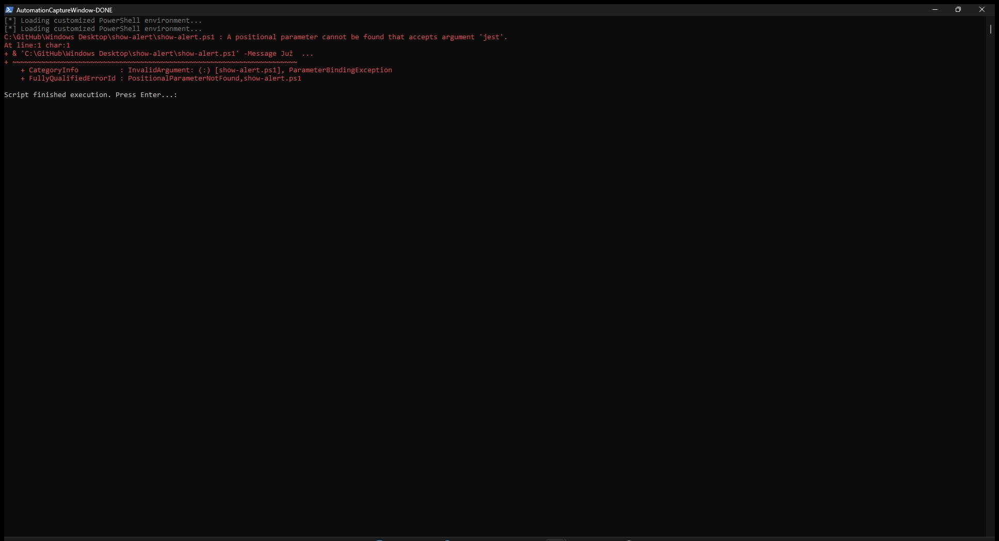
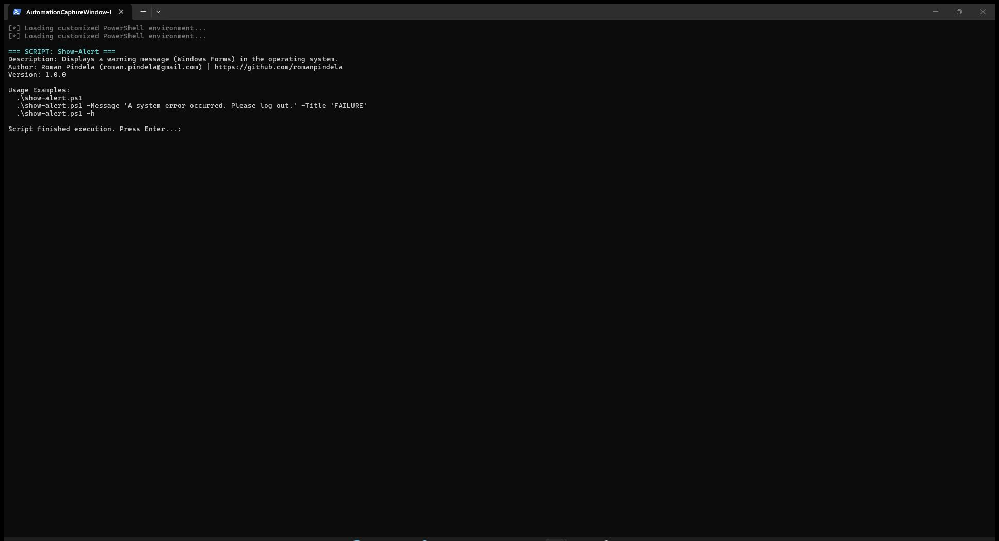

# Invoke-InteractiveScript

A PowerShell utility designed to bypass Windows Session 0 isolation during WinRM remote execution. It allows administrators to execute GUI-based PowerShell scripts (like forms or pop-ups) directly onto the desktop of the currently logged-on user on a remote machine.

## Why is this needed?
By default, when you use `Invoke-Command` to run a script on a remote computer, Windows executes it in a non-interactive background session (Session 0). Any attempt to display a GUI (e.g., using Windows Forms or WPF) will result in an error or a hidden, hanging process. 

`Invoke-InteractiveScript` solves this by:
1. Identifying the user currently interacting with the remote computer.
2. Securely transferring the payload to a temporary public location.
3. Creating and triggering a dynamic Scheduled Task bound to the built-in `Users` group.
4. Projecting the GUI to the active desktop.
5. Actively waiting for the user to close the window, and seamlessly cleaning up traces (removing the task and temp files) upon completion.

## Usage

```powershell
.\invoke-interactive-script.ps1 -ComputerName <IP_or_Hostname> -ScriptPath <Local_Script_Path> [-ArgumentList <Args>]
```

### Parameters

| Parameter | Description |
| :--- | :--- |
| `-ComputerName` | The target remote computer hostname or IP address. |
| `-ScriptPath` | The path to the local `.ps1` script file that you want to execute interactively. |
| `-ArgumentList` | *(Optional)* An array of arguments to pass to the remote script. Command-line parameters are protected and encoded via Base64 to prevent parsing errors. |
| `-Credential` | *(Optional)* PSCredential object. If not provided, you will be prompted automatically. |

### Examples

**1. Displaying an interactive alert window to a user:**
```powershell
.\invoke-interactive-script.ps1 -ComputerName "10.10.1.96" -ScriptPath ".\show-alert.ps1"
```

**2. Passing specific arguments to the remote GUI script:**
```powershell
.\invoke-interactive-script.ps1 -ComputerName "10.10.1.96" -ScriptPath ".\show-alert.ps1" -ArgumentList '-Message "Please contact the IT Helpdesk immediately." -Title "SECURITY WARNING"'
```

## Execution View

### Standard Run


### Help Output (-Help)

