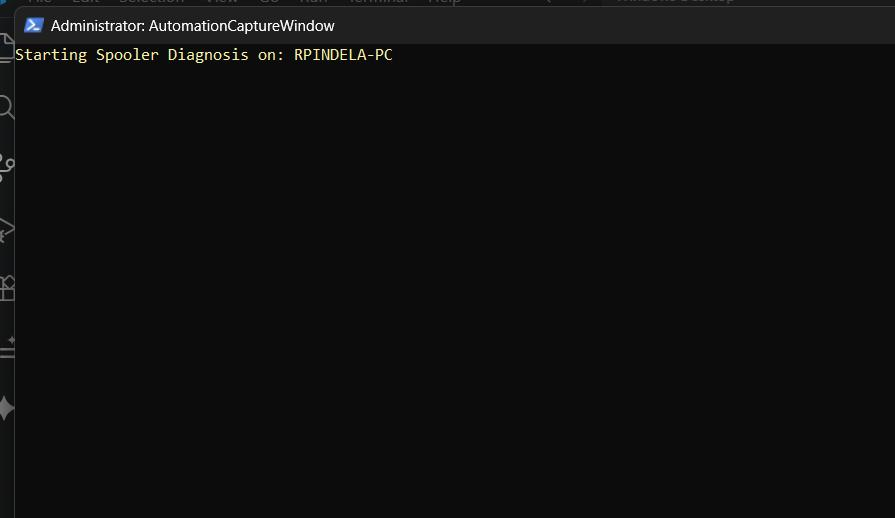
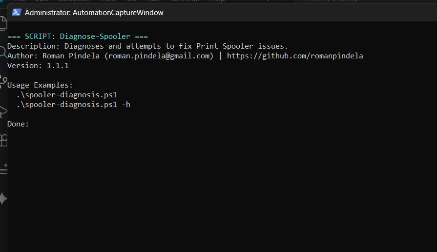

# spooler-diagnosis.ps1

A professional administrative script for diagnosing the Windows Print Spooler service on local machines.

## Features
- **Service Validation:** Checks the current state of the Print Spooler service.
- **Queue Analysis:** Queries WMI/CIM to detect the number of stuck print jobs.
- **Printer Status Check:** Retrieves a list of installed printers and highlights any paused devices in color.
- **Clean Architecture:** Built according to CleanCode principles with proper error handling.

## Parameters

| Parameter | Type | Required | Description |
| :--- | :--- | :--- | :--- |
| `-ShowHelp` (`-h`) | `Switch` | No | Displays the interactive script help menu. |

## Usage Examples
```powershell
# Local diagnosis
.\spooler-diagnosis.ps1
```

## Example Output
```text
Starting Spooler Diagnosis on: WORKSTATION-01
Service Status: Running
Current Print Jobs in Queue: 0

Checking printer statuses...
--- Printer Status List ---
  > Microsoft Print to PDF - Status: Normal
  > Fax - Status: Normal

[i] Spooler appears to be operating normally.
```
Author Information
Author: Roman Pindela

Email: roman.pindela@gmail.com

GitHub: romanpindela

Version: 1.1.0

## Execution View

### Standard Run


### Help Output (-Help)

